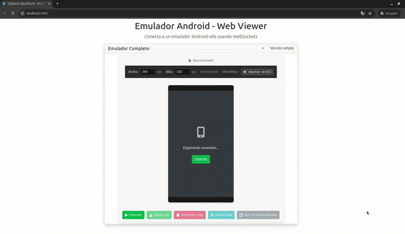

# mobile-emulator-web-viewer

Una aplicación web que permite visualizar dispositivos móviles en tu sitio web.




## Requisitos Previos

- Node.js (versión 14 o superior)
- npm o yarn

## Instalación

1. Clona el repositorio:

```bash
git clone https://github.com/tu-usuario/mobile-emulator-web-viewer.git
```

2. Instala las dependencias:

```bash
npm install
```

3. Inicia el servidor de desarrollo:

```bash
npm start
```

4. Abre tu navegador y navega a `http://localhost:3000` para ver la aplicación.

